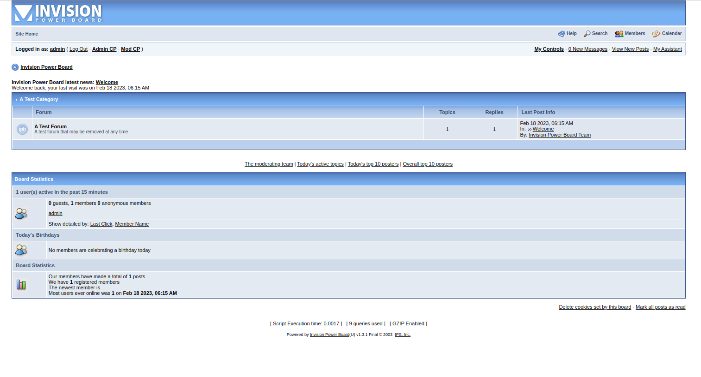
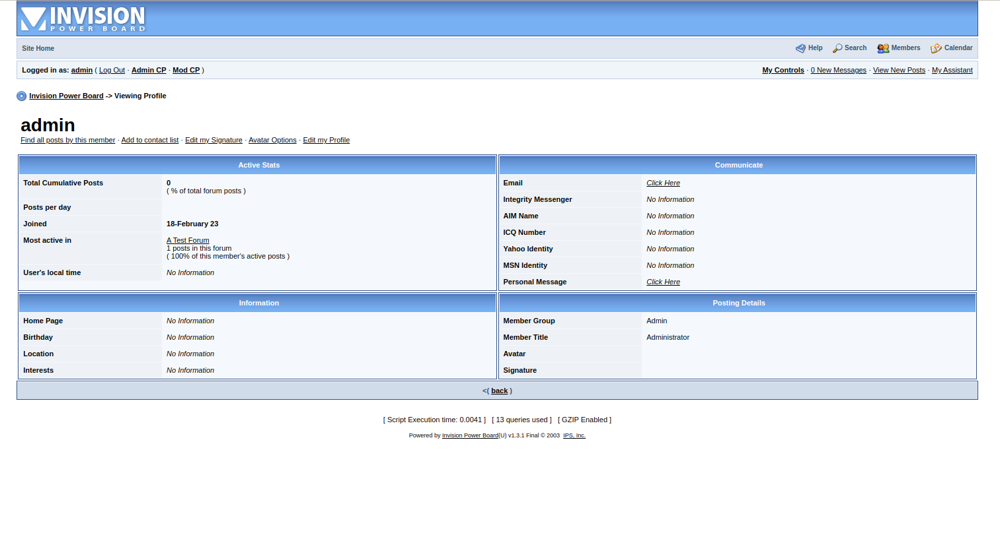
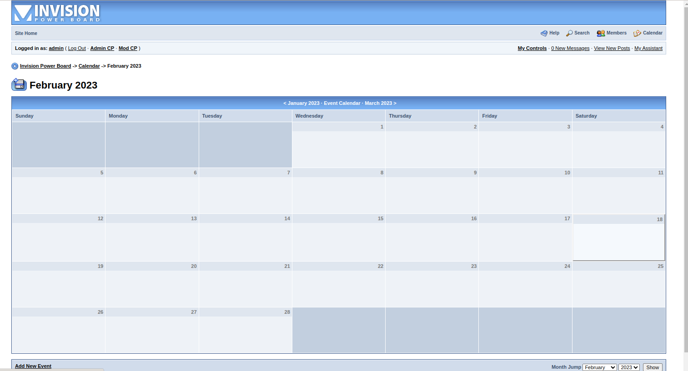
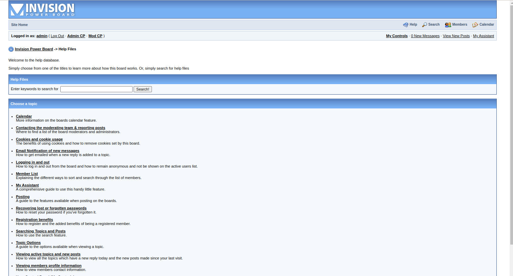
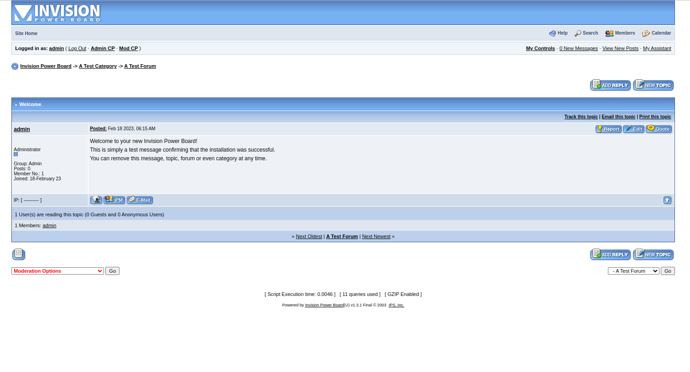

# Invision Power Board v1.3.1 Archive (w/ Working Docker)

## Introduction
This is a archive of Invision Power Board I found sitting round in one of my backups. For archival and educational sake I decided to upload it here along with a working docker instance. Fun fact, this is technically the last free version of Invision before it became a paid product back in 2003. **With that being said, this code isn't mine, I didn't write it, and I do not own it.** It's here for you all to enjoy a blast from the past and to be able to do so on modern hardware.

## ⚠️ Security Warning ⚠️
This is very much legacy software written in PHP 4 syntax and only runs correctly under MySQL 4 **You should not for any reason run this software on a production server.** I don't even know why you would to be completely honest. If you're looking for bulletin board software there are plenty of modern day and updated platforms you can use such as:

### Modern Types:
- Flarum https://flarum.org/
- Discoruse: https://www.discourse.org/

### Classic Types:
- phpBB https://www.phpbb.com/
- MyBB https://mybb.com/
- vBulletin https://www.vbulletin.com/ (Non-Free)
- Invision https://invisioncommunity.com/ (Non-Free)

## Developer Notes
The contents of `/public` have been modified to work with PHP 5.4 to remove `call-time pass-by-reference`. Furthermore, the docker adds a prepend file to `php.ini` to add back in variables that were removed in this version. You can find this prepend file in the `docker/http/php` folder as `prepend.php`.

The MySQL 4 instance was built with the help of this archive: https://github.com/andrebossi/mysql4. However, it has been heavily modified to fit the use case of this archive. Upgrading to MySQL 5 isn't an option without a major refactor of the queries used. They did a lot of integer assignments with empty strings <.<;

## Directory Items
- /docker - Contains docker build items
- /src - Contains unmodified source files from the original archive including install documentation and tools.
- /public - The invision board source files for the docker instance. (Modified, More Later)
- package.json - NPM/NodeJS package file used strictly for easy commands.

## Install Requirements
- Docker
- Docker Compose
- (Optional) NodeJS / NPM

## Building and Starting Instance

### Option 1: Yarn
```
yarn docker:up
```

### Option 2: NPM
```
npm run docker:up
```

### Option 3: Shell Commands
```
docker build -t invision:mysql ./docker/mysql && docker build -t invision:http ./docker/http && docker-compose up -d
```

## Installation

 1. Go to http://127.0.0.1/sm_install.php
 2. Start the installer
 3. Use the following values for the configuration:
   - Script URL: `http://127.0.0.1`
   - SQL Host:
     - If you have legacy docker-compose `invision_mysql_1`
     - If you have modern docker-compose `invision-mysql-1`
     - If you don't know, do a `docker ps` and check the `NAMES` column.
   - SQL Database Name: `ivboard`
   - SQL Username: `root`
   - SQL Password: `Aq1Sw2De3`
   - Admin Username: `admin`
   - Admin Password: `password`
   - Email Address: `root@localhost`
 4. Click proceed and keep clicking through until you get to the login screen.
 5. Great Success! You should have an instance of invision board running.

## Screenshots





